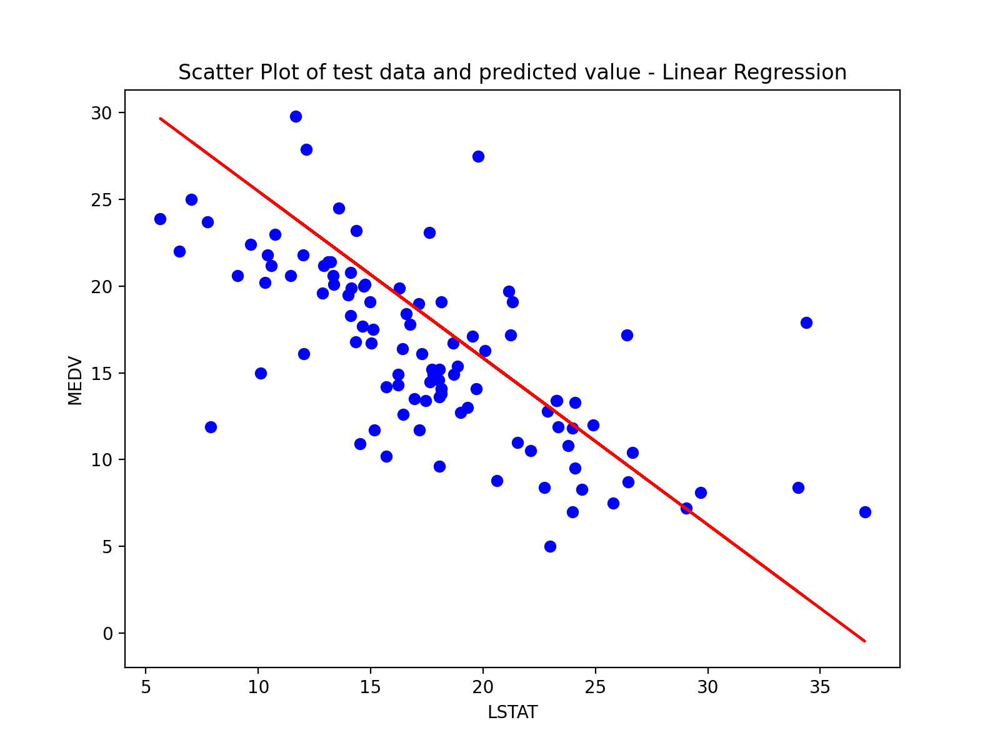

# cmpe255-spring21 - Assignment 1

## Overview

sklearn already consists of some standard datasets, including boston housing. Therefore, sklearn is used to load boston data set.
rmse and r square values are calculated from test models.

**Code must be run by executing python script linearReg.py only. **

## Linear Regression
Dataset has 13 features in input data set and 1 target label "MEDV" in target data set. Linear regression is run one by one by taking into consideration each feature. Upon analysis, we found LSTAT to have best rmse and r square. Following is the image of graph:

## Polynomial Regression
Since question demanded using feature used in Linear Regression, LSTAT is used. It had best outcome in Linear regression. Model is evaluated for degree 2 and 20. It is noticed that error is very high for degree 20.

Following is the image of graph:

## Multiple Regression
We have selected top 3 features with highest absolute correlation to MEDV and then evaluated the model and calculated rmse, r squared value and adjusted r square.

## Result
As per our computation, best result was given by **Polynomial Regression with degree 2**. Following is the screenshot of python script execution.

