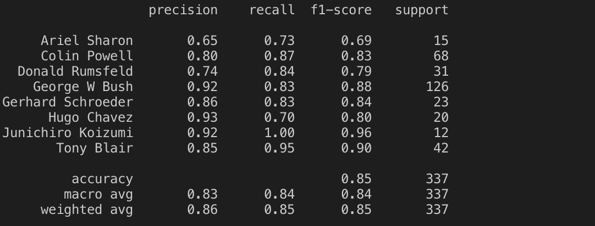
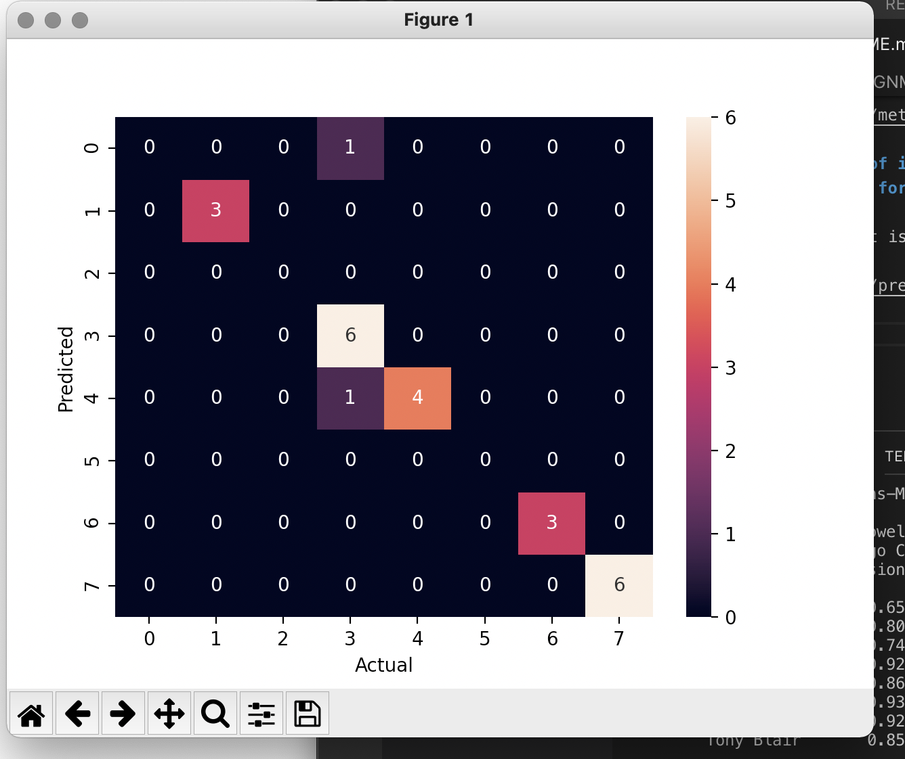

# ASSIGNMENT 2

Received following results:

**1.Precision, Recall, f1-score and support**

Following table gives above metrics:

**2.4x6 subplots of images using names as label with color black for correct instances and red for incorrect instances**

Following sub plot is achieved. 

**3.confusion matrix between features in a heatmap**

