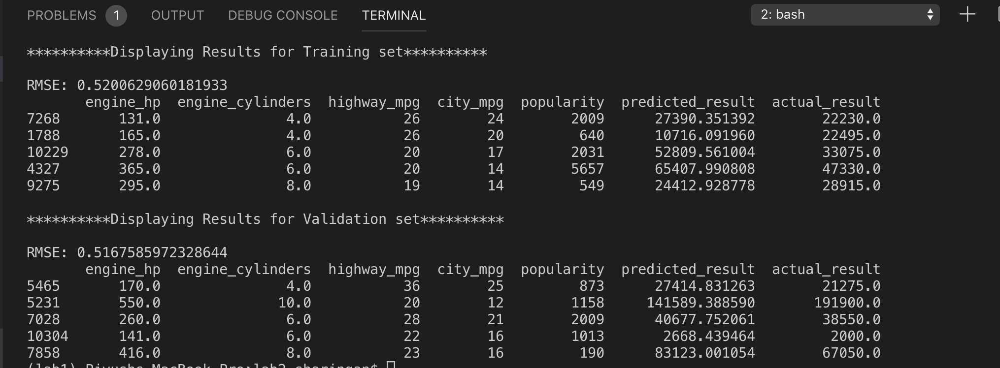

# Lab 2 - Linear Regression


* 20% of data goes to validation,
* 20% goes to test, and
* the remaining 60% goes to train.

```
y = g(x) = g(x1, x2, ..., xn) = w0 + x1 w1 + x2 w2 + ... + xn wn
```

Bias term is the value we would predict if we did not know anything about the car; it serves as a baseline.


Code is contained in predict-car-price.py

Used Validation framework and linear_regression() of Baseline solution. Modified Baseline solution a little bit in the sense, only features having top 5 highest correlation are considered for training data.

Result is displayed for both Training Data and Validation Data. Following is the image of results:

