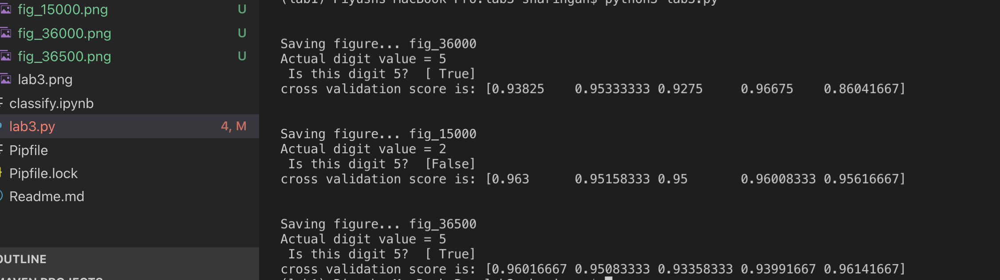

# CMPE 255 LAB 3

Try to build a number-5 detector binary classifier for the MNIST dataset from Scikit-Learn.

Use lab3.py as baseline and How to load MINIST Dataset

## Approach

Sklearn's fetch_openml() is used to load mnist dataset. Since fetch_openml() gives unsorted data so it is sorted based on target values so that we can easily test our data.

Then, we select a random digit whose classification we will predict whether it is 5 or not. 

We now train our data for values of X. Note that we take y_train_5 value as y_train == 5. This is because this statement will give us series of booleans which show whether given entry is 5 or not. We train our data using this X,y_train_5 dataset.

Once trained, we pass the random digit we calculated in previous step and pass it to our classifier to see whether it is detecting the result properly or not. We also find the cross value score.

We can pass random digits from test set of our data set and verify the claasification result. Cross validation score will showcase accuracy of the model.

## Result

The following image shows actual digit value and its corresponding result whether it is 5 or not. Image is not shown in results, however, when running python script, first image will be shown and then its computation will get executed. All the saved images are put inside /images folder.

