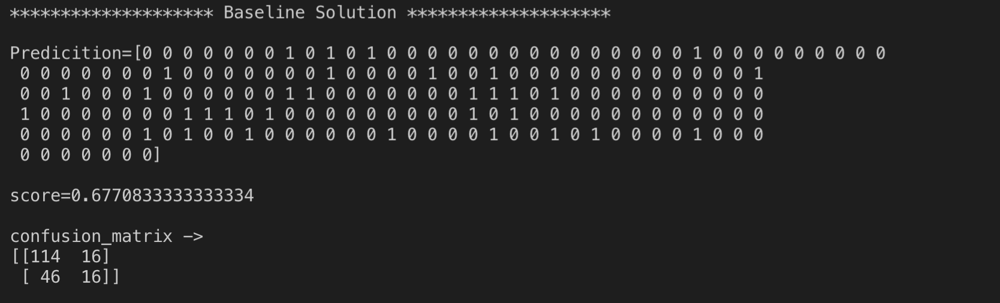
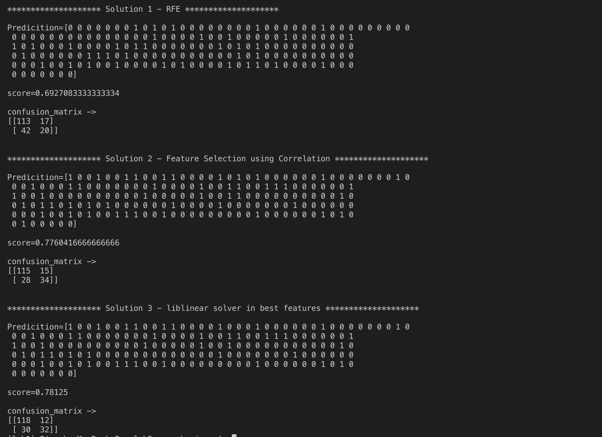

# Lab 3 New - Classification

Following three methods are used to improve score and achieve a better confusion matrix than baseline solution.

**1. Recursive Feature Elimination on Logistic regression - Solution 1:**

RFE recursively removes attributes and builds model based on what is remaining. We have taken remaining 3 features for model. The score and confusion matrix were better than what was received by using baseline solution by 2.36%. 

**2. Feature Selection - Solution 2:**

Correlation of dataset with label is calculated and features having top 3 correlation are taken as features. The score and confusion matrix were better than what was received by using baseline solution by 14.62%. 

**3. Feature Selection and solver liblinear in Logistic Regression - Solution 3:**

Top 3 features with best correlation are selected and then Logistic Regression is applied to this data. Solver type for our Logistic regression is 'liblinear'. The score and confusion matrix were better than what was received by using baseline solution by 15.36%. 

## Results

Baseline solution results

Proposed Solution results

## Comparison table

| Solution         | Accuracy      | Confusion Matrix  | Comments(wrt baseline)                                                      |
| -----------------|:-------------:|:-----------------:| ---------------------------------------------------------------------------:|
| Baseline Solution| 0.677         |[[114 16][46 16]]  | Baseline solution                                                           |
| Solution 1       | 0.693         |[[113 17][42 20]]  | 2.36% increased accuracy, used RFE with Logistic Regression(LR)             |
| Solution 2       | 0.776         |[[115 15][28 34]]  | 14.62% increased accuracy, used feature selection with LR                   |
| Solution 3       | 0.781         |[[118 12][30 32]]  | 15.36% increased accuracy, used feature selection and liblinear solver in LR|